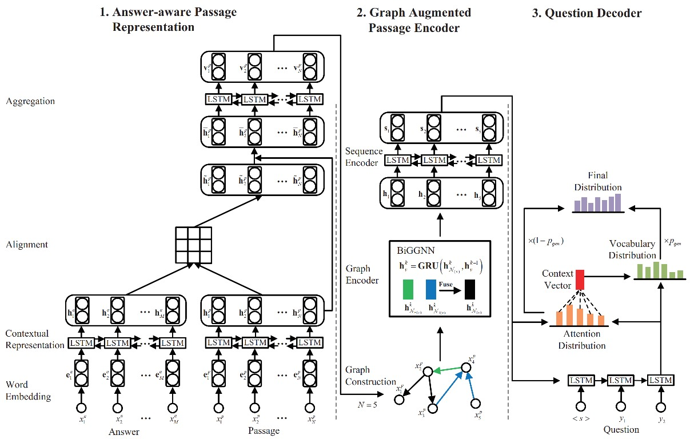

# Graph Augmented Sequence-to-Sequence Model for Neural Question Generation
This repository is the implement of our paper Graph Augmented Sequence-to-Sequence Model for Neural Question Generation.

## Model Architecture



## Setup
- Check the packages needed or simply run the command:
```console

pip install -r requirements.txt
```
- Download the preprocessed dataset from [SQuAD Split1](https://drive.google.com/drive/folders/1EoIqyqaSIsES_MrsKnHNx4SYRIxom0YD), [SQuAD Split2](https://drive.google.com/drive/folders/11gett0qzTW2SvNjjcRLJik-FommhP8bs), and [MS MARCO](https://drive.google.com/drive/u/1/folders/19ws8j7ojK4MqELeiLunggC0u-uqEElRY), and put them into `data/`.

## Run the model
- Run the model on SQuAD Split1 dataset
```console

bash src/train_squad_split1.sh
```

- Run the model on SQuAD Split2 dataset
```console

bash src/train_squad_split2.sh
```

- Run the model on MS MARCO dataset
```console

bash src/train_marco1.sh
```

## Test
For reproducibility, download the trained models from the link given [here](https://drive.google.com/drive/u/1/folders/1yECsyvoV4rxSlerTsEuQUw6RCfiY87tT), and put them into `out/`.
- Test the model on SQuAD Split1 dataset
```console

bash src/test_squad_split1.sh
```

- Test the model on SQuAD Split2 dataset
```console

bash src/test_squad_split2.sh
```

- Test the model on MS MARCO dataset
```console

bash src/test_marco1.sh
```
## Acknowledgements
- This code is modified based on the [RL-based-Graph2Seq-for-NQG](https://github.com/hugochan/RL-based-Graph2Seq-for-NQG).
- Special thanks to the [RL-based-Graph2Seq-for-NQG](https://github.com/hugochan/RL-based-Graph2Seq-for-NQG) and [RE2](https://github.com/alibaba-edu/simple-effective-text-matching-pytorch) for sharing their codes and datasets.

	
